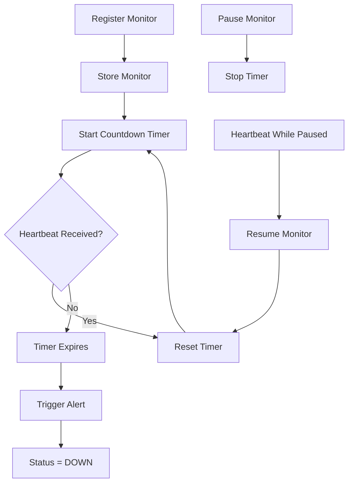

# Pulse-Check-API Architecture Design

## Overview
This project implements a Dead Man's Switch API for monitoring remote devices.

A monitor is created for each device with a timeout period. If the device fails to send a heartbeat before the timeout expires, the system triggers an alert and marks the monitor as down.

---

## Monitor State

Each monitor contains:

```json
{
  "id": "device-123",
  "timeout": 60,
  "alertEmail": "admin@critmon.com",
  "status": "active",
  "lastHeartbeat": "2026-06-21T10:00:00Z"
}
```

### Status Values

* active
* paused
* down

---

## API Endpoints

### Register Monitor

POST /monitors

### Send Heartbeat

POST /monitors/:id/heartbeat

### Pause Monitor

POST /monitors/:id/pause

### Get Monitor Status (Developer's Choice)

GET /monitors/:id

### Get All Monitors (Dashboard Support)

GET /monitors

---

## System Flow



---

## Developer's Choice

Additional Features:

1. MySQL persistence
2. Monitoring Dashboard
3. View all monitors endpoint

Reason:
These features improve observability and ensure monitor information survives server restarts.

```
```
