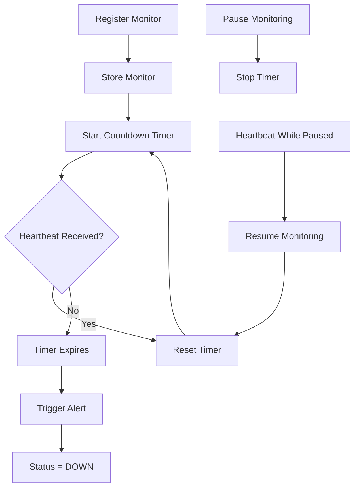

# Pulse-Check-API Architecture Design

## Overview

Pulse Check API implements a Dead Man's Switch monitoring system for remote devices such as solar farm sensors, weather stations, and other critical infrastructure.

Each device registers a monitor with a configurable timeout period. Devices must periodically send heartbeats to indicate that they are still operational. If a heartbeat is not received before the timeout expires, the system automatically marks the device as DOWN and triggers an alert.

---

## Monitor State

Each monitor maintains the following information:

```json
{
  "id": "device-123",
  "timeout": 60,
  "alert_email": "admin@critmon.com",
  "status": "active",
  "paused": false
}
```

### Status Values

| Status | Description                                    |
| ------ | ---------------------------------------------- |
| active | Device is being monitored and timer is running |
| paused | Monitoring has been temporarily suspended      |
| down   | Timer expired and device is considered offline |

---

## API Endpoints

### Register Monitor

```http
POST /monitors
```

Creates a new monitor and starts its countdown timer.

---

### Send Heartbeat

```http
POST /monitors/:id/heartbeat
```

Resets the countdown timer and keeps the monitor active.

---

### Pause Monitor

```http
POST /monitors/:id/pause
```

Stops the monitor timer and prevents alerts from firing.

---

### Get Monitor Status

```http
GET /monitors/:id
```

Returns information about a specific monitor.

---

### Get All Monitors

```http
GET /monitors
```

Returns all registered monitors for dashboard visibility.

---

## System Flow



---

## Core Components

### Pulse Check API

Receives requests from monitored devices and administrators.

### Monitor Service

Contains the business logic responsible for:

* Monitor registration
* Heartbeat processing
* Timer management
* Status transitions
* Alert generation

### Timer Manager

Maintains monitor timers using:

* JavaScript Map storage
* setTimeout()
* clearTimeout()

### Alert Service

Triggers alerts whenever a monitor fails to send a heartbeat before its timeout expires.

### Monitoring Dashboard

Provides administrators with visibility into monitor status and operational activity.

---

## Developer's Choice Feature

### Monitoring Dashboard & Device Management

To improve observability and usability, a complete monitoring dashboard was implemented.

Features include:

* Dashboard monitor overview
* Device details page
* Monitor status filtering

  * Active
  * Paused
  * Down
* Live countdown timer
* Activity timeline logging
* Monitor management actions

  * Send Heartbeat
  * Pause Monitoring
  * Resume Monitoring

### Reason for Addition

The dashboard makes the system more practical for administrators by providing operational visibility into device health and monitor activity. Instead of relying solely on API responses, administrators can visually track monitor status, investigate failures, and manage devices from a centralized interface.

---

## Storage Strategy

For this implementation, monitor data is maintained using in-memory JavaScript Map storage.

Benefits:

* Fast access
* Simple implementation
* Suitable for prototype and demonstration purposes

Future versions can extend this design using persistent database storage such as MySQL or PostgreSQL.
